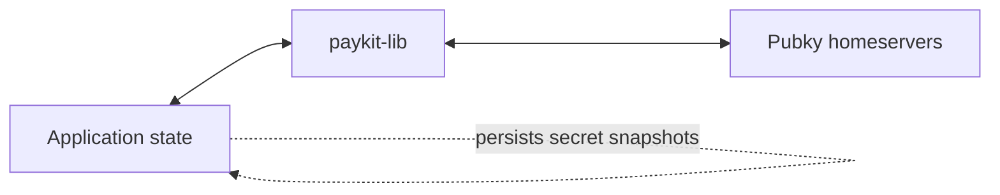
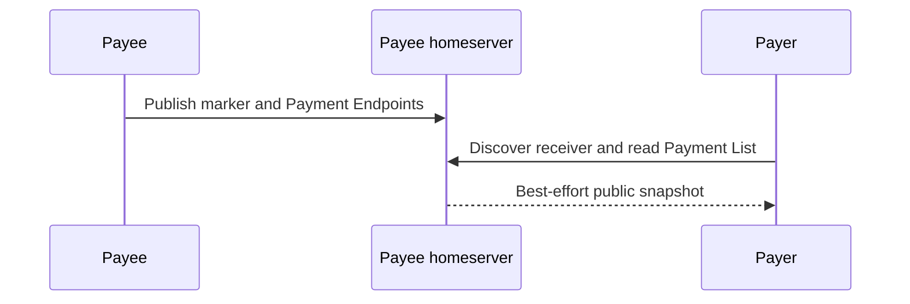
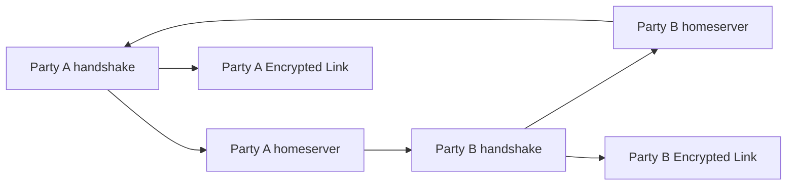
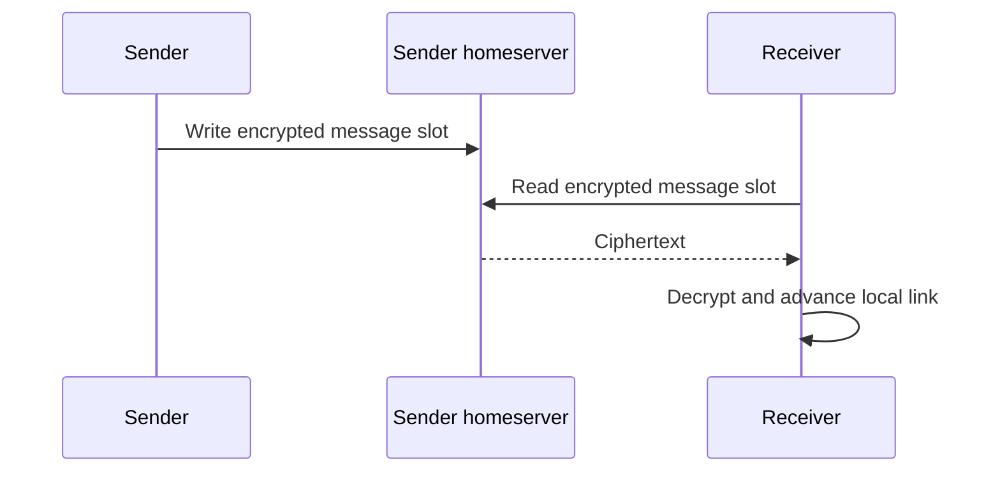
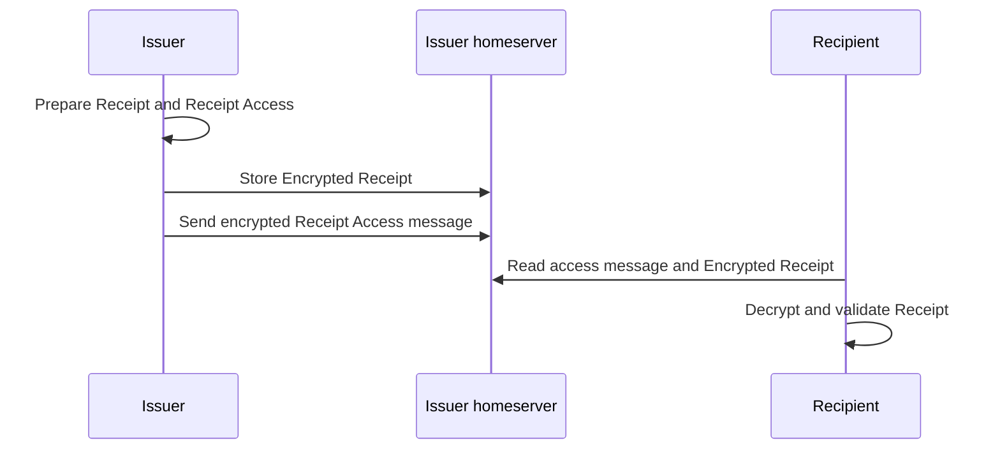
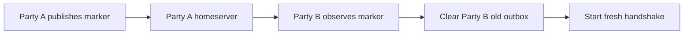

# Paykit Library State Updates

`paykit-lib` is stateless. It changes caller-owned Rust values and Pubky
homeserver files, but it has no database, queue, event log, or lifecycle index.

The diagrams below show only the happy path. Exact state changes, failures, and
paths are kept in tables because they are easier to compare there.

For payment flows, **Payer** sends value and **Payee** receives value. Either
party can initiate an Encrypted Link or send a Private Application Message.

## Mental model

The application owns Encrypted Link snapshots, dedupe, retries, and derived
payment state. The library owns protocol validation, encryption, and individual
Pubky operations.

## Public Payment Endpoints

| Use case | Caller-owned state | Homeserver change |
| --- | --- | --- |
| Publish Receiver Marker | Returned marker value only | Write `receiver.json` on payee homeserver |
| Remove Receiver Marker | None | Delete `receiver.json` |
| Publish or replace endpoint | None | Write one endpoint file |
| Remove endpoint | None | Delete one endpoint file |
| Discover receiver paths | Returned path list only | Read marker and endpoint directories |
| Read Payment List | Returned list only | List directory, then read each endpoint |
| Read one endpoint | Returned optional payload only | Read one endpoint file |

A Payment List read is not atomic. The directory and endpoint files can change
between requests. Missing files become `None` or an empty list; deleting already
missing public state succeeds.

## Establish an Encrypted Link

| Step | In-memory change | Homeserver operation |
| --- | --- | --- |
| Initiate or accept | Create handshake object | None |
| Advance | Advance Noise handshake state | Write local slot or read remote slot |
| Complete | Replace handshake with Encrypted Link | Final handshake traffic only |
| Snapshot | Produce secret snapshot bytes | None |
| Restore | Recreate handshake or link | No direct Paykit write |
| Close | Consume in-memory link | None |

Both applications must persist snapshots as secrets. Restores require the same
counterparty and receiver paths. Persisting a stale link snapshot can cause
replay or counter desynchronization.

## Exchange private messages

Private Payment Lists, Payment Request events, Payment Proofs, and Receipt Access
all use this transport.

| Phase | Sender state | Receiver state | Homeserver state |
| --- | --- | --- | --- |
| Before send | Current link snapshot | Unchanged | No new slot |
| Successful send | Write counter advances | Unchanged | New slot on sender homeserver |
| Successful receive | Unchanged | Read counter advances | Slot remains remotely stored |
| Parse | Unchanged | Typed or raw caller-owned value | No change |

The receiver reads the sender's homeserver. Receiving does not copy the message
to the receiver's homeserver.

The application must persist received Event Messages and dedupe state before it
persists the advanced link snapshot. Otherwise a crash can either replay or skip
application processing.

### Message-specific meaning

| Message | Sender | Durable semantics owned by caller |
| --- | --- | --- |
| Private Payment List | Payee | Newest valid complete list supersedes older lists |
| Payment Request | Payee | Start lifecycle for one Payment Request ID |
| Acceptance | Payer | Preserve every event in order |
| Rejection | Payer | Preserve every event in order |
| Cancellation | Either party | Preserve every event in order |
| Payment Proof | Payer | Validate against known request and preserve event |
| Receipt Access | Receipt issuer | Preserve, dedupe, and associate with issuer |

`paykit-lib` sends and parses these messages but does not retain current state,
enforce sender roles, derive request lifecycle state, schedule recurring
payments, execute payments, or confirm settlement.

## Issue and retrieve a Receipt

| Step | Local state | Homeserver change |
| --- | --- | --- |
| Prepare | Create plaintext Receipt, ciphertext, and access descriptor | None |
| Store | Keep caller-owned prepared value | Write Encrypted Receipt on issuer homeserver |
| Send access | Advance issuer link | Write private message slot on issuer homeserver |
| Receive access | Advance recipient link | Read issuer private slot |
| Fetch artifact | Hold encrypted JSON | Read issuer Receipt Location |
| Decrypt | Produce plaintext Receipt | None |

Store the Encrypted Receipt before sending Receipt Access. `paykit-lib` does not
fetch the artifact for the recipient; the caller fetches it using the issuer
identity and Receipt Location. The location is authenticated during decryption.

## Recovery

| Use case | Local state | Homeserver change |
| --- | --- | --- |
| Publish marker | Caller retains marker value | Write pairwise marker locally |
| Fetch marker | Return marker or `None` | Read counterparty marker |
| Remove marker | None | Delete local marker |
| Clear old outbox | None | Delete local derived message slots |
| Close link | Consume in-memory link | None |

The library supplies primitives only. Higher layers decide when recovery is
required and when old snapshots, queues, or markers can be discarded.

## Homeserver paths

| State | Receiver-scoped path |
| --- | --- |
| Receiver Marker | `/pub/paykit/v0/<receiver_path>/receiver.json` |
| Public Payment Endpoint | `/pub/paykit/v0/<receiver_path>/endpoints/<identifier>` |
| Encrypted Link stream | `/pub/paykit/v0/private/<receiver_path>/messages/<pair_hash>/<slot>` |
| Encrypted Receipt | `/pub/paykit/v0/private/<receiver_path>/receipts/<receipt_id>` |
| Recovery Marker | `/pub/paykit/v0/private/<receiver_path>/encrypted-link-recovery/<pair_hash>` |

Recovery markers are publicly readable Pubky resources even though their path is
below the `private` prefix. Pairwise derivation limits casual enumeration; it is
not an access-control boundary.

## Failure and retry reference

| Operation | Retry or failure behavior |
| --- | --- |
| Public file I/O | No Paykit-level retry |
| Handshake write failure | Restore pre-mutation state and return pending up to configured limit |
| Private send transport failure | Retry according to Encrypted Link send policy |
| Private receive transport failure | Return error without caller-level durable handling |
| Outbox clearing | Paginated deletes can partially succeed |
| Receipt store and access send | Separate operations; caller retries them independently |

## Implementation anchors

- Public state: `src/payment_endpoint.rs`, `src/receiver_marker.rs`,
  `src/pubky_routing.rs`
- Encrypted Links: `src/encrypted_link/`
- Private Payment Lists: `src/private_payment_list.rs`
- Payment Requests: `src/payment_request/`
- Receipts: `src/receipt/`
- Recovery: `src/encrypted_link_recovery.rs`
