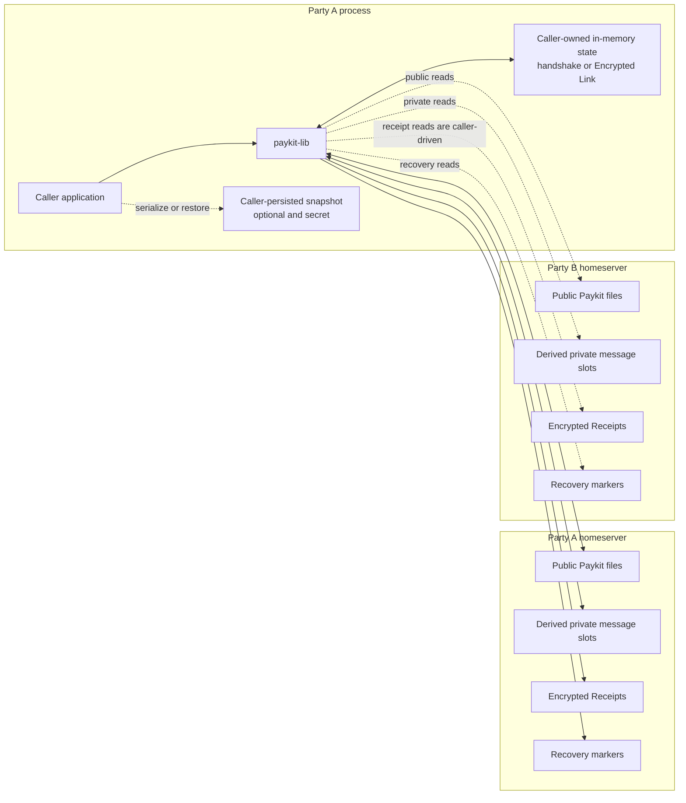
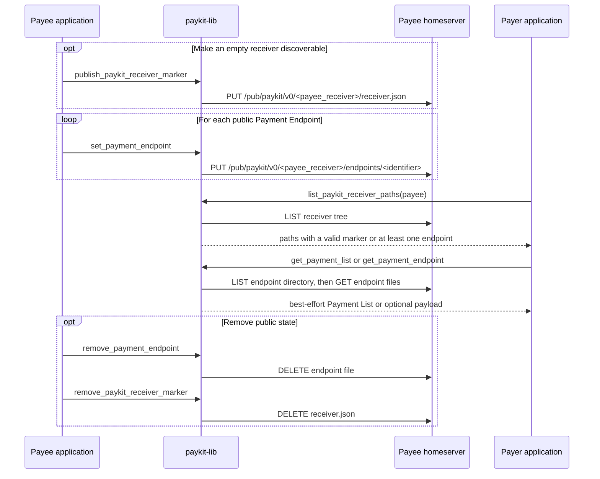
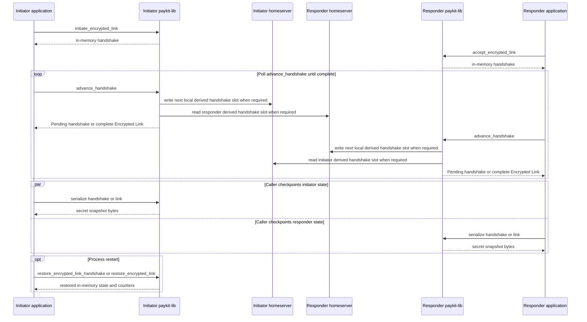
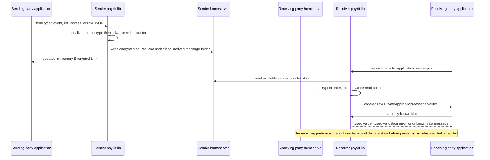
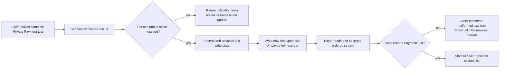
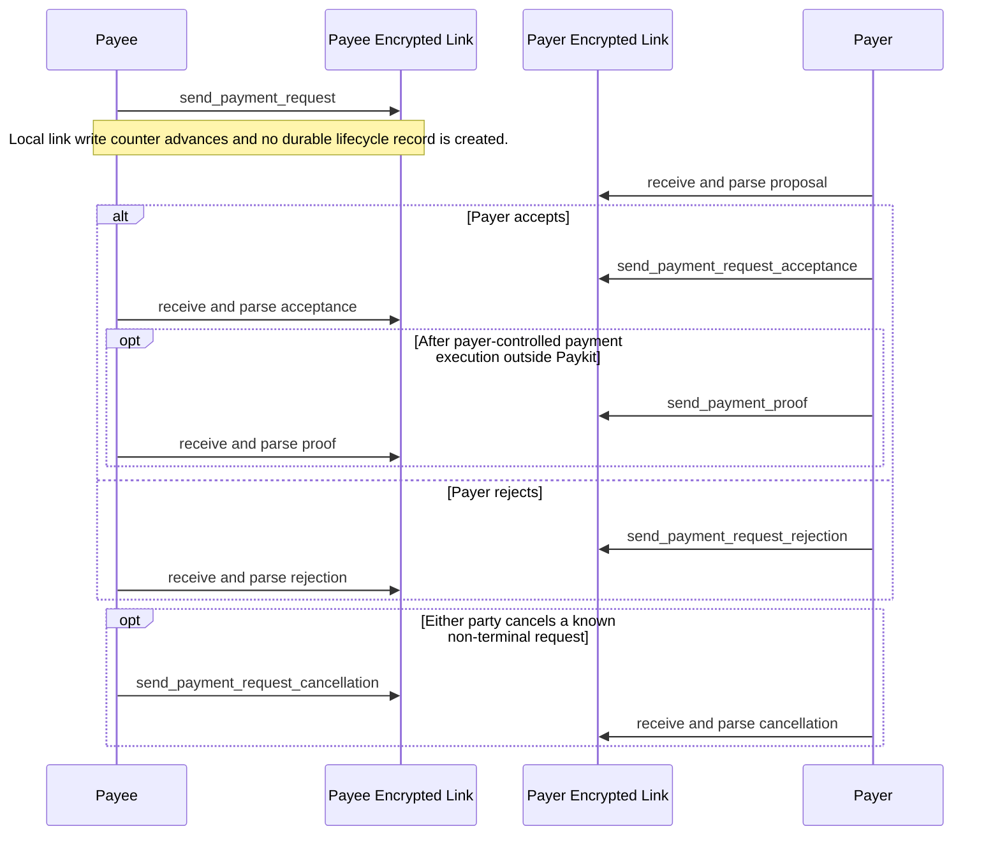
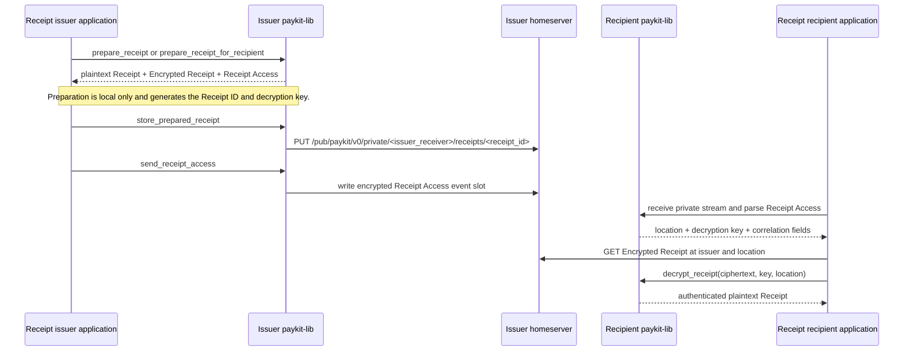
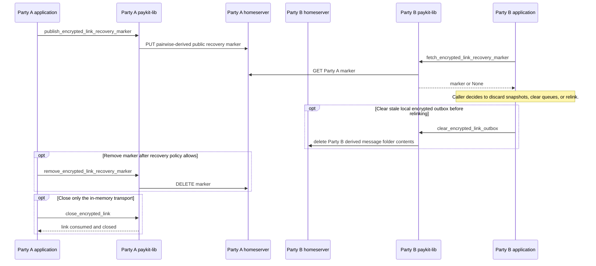

# Paykit Library State Updates

This document shows the state transitions caused by the stateful I/O APIs in
`paykit-lib`. The library itself is stateless: it returns or mutates caller-owned
Rust values, while durable network state lives on Pubky homeservers. Persisting
Encrypted Link or handshake snapshots is the caller's responsibility.

For payment flows, the diagrams use **Payer** and **Payee** rather than the
ambiguous sender/receiver terms. For Encrypted Link setup they use **Initiator**
and **Responder**. Either payment party can initiate a link, send a Private
Application Message, or issue a Receipt.

## State boundaries

- `paykit-lib` has no database, event log, retry queue, or durable lifecycle
  index.
- Public files and Encrypted Receipts have stable Paykit paths. Encrypted Link
  handshake and transport slots are derived per counterparty receiver pair;
  `pubky-noise` owns their individual counter-based file names.
- An Encrypted Link or handshake object advances Noise counters in memory.
  Snapshot bytes contain secret key and counter material and must be protected by
  the caller.

### Homeserver path categories

| State | Receiver-scoped path |
| --- | --- |
| Public Payment Endpoint | `/pub/paykit/v0/<receiver_path>/endpoints/<payment_endpoint_identifier>` |
| Receiver Marker | `/pub/paykit/v0/<receiver_path>/receiver.json` |
| Encrypted Link stream | `/pub/paykit/v0/private/<receiver_path>/messages/<pair_hash>/<slot>` |
| Encrypted Receipt | `/pub/paykit/v0/private/<issuer_receiver_path>/receipts/<receipt_id>` |
| Encrypted Link Recovery Marker | `/pub/paykit/v0/private/<receiver_path>/encrypted-link-recovery/<pair_hash>` |

The pair hash and asymmetric read/write paths are derived from both parties,
both receiver paths, a shared secret, and a feature-specific domain separator.
The markers are publicly readable Pubky resources despite living below Paykit's
`private` path prefix; the pairwise-derived path limits casual enumeration but
is not an access-control boundary.

## Publish and discover public receiver state

Covers receiver marker and public Payment Endpoint APIs:

- `publish_paykit_receiver_marker` / `remove_paykit_receiver_marker`
- `set_payment_endpoint` / `remove_payment_endpoint`
- `list_paykit_receiver_paths`, `get_paykit_receiver_marker`,
  `get_payment_list`, and `get_payment_endpoint`

State effects:

- Publication and removal do not create local library records.
- Missing endpoint files/directories are represented as `None` or an empty
  Payment List. Removing an already missing endpoint or marker succeeds.
- `get_payment_list` is not an atomic snapshot: the directory listing and file
  reads can observe different remote revisions.
- A receiver remains discoverable while it has a valid Receiver Marker or at
  least one public Payment Endpoint.

## Establish and resume an Encrypted Link

Covers `initiate_encrypted_link`, `accept_encrypted_link`, `advance_handshake`,
handshake snapshots/restores, and established link snapshots/restores.

State effects and failure rules:

- Each advance mutates the caller-owned handshake and may read or write derived
  homeserver handshake data.
- A completed handshake replaces the in-progress object with an in-memory
  `EncryptedLink`; the library does not persist that transition.
- Handshake write failures are recovered from a pre-mutation snapshot and return
  `Pending` up to the configured recovery-attempt limit.
- Restores require the same local and remote receiver paths. A stale established
  link snapshot can replay messages or desynchronize Noise counters.

## Exchange Private Application Messages

This common transport flow covers:

- Private Payment Lists through `set_private_payment_list`
- Payment Request proposal, acceptance, rejection, cancellation, and Payment
  Proof send helpers
- Receipt Access through `send_receipt_access`
- raw intake through `EncryptedLink::receive_private_application_messages`

The apparent sender-to-receiver transfer is implemented as a write to the
sender's homeserver followed by the receiver reading that derived folder. The
receiver's own homeserver is not updated by intake.

Message semantics:

- Private Payment List is a **Latest-State Message**. The library sends every
  call; a stateful caller decides which valid list supersedes older lists.
- Payment Request lifecycle messages and Receipt Access are **Event Messages**.
  Every valid event matters and must be retained in stream order.
- The library neither persists raw events nor enforces durable Event ID dedupe,
  conflicting-ID detection, role authorization, or full Payment Request
  lifecycle policy. Those are SDK/application responsibilities.
- A successful send advances the in-memory write state. The caller should
  checkpoint the new link state together with its own durable send status.
- A successful receive advances the in-memory read state. If raw events are
  stored but the new snapshot is not, replay is expected and must be deduped.

## Private Payment List update and clear

A clear is not a special delete. It is a newer encrypted Private Payment List
whose `payment_endpoints` map is empty.

The complete map must be supplied on every update. The library does not merge
endpoints or retain the previous list.

## Payment Request lifecycle and Payment Proofs

All arrows use the private transport flow above and therefore create encrypted
slots on the sending party's homeserver. `PaymentProof::validate_for_request`
checks structural correlation only. Payment execution, settlement, recurring
scheduling, sender-role authorization, and durable lifecycle derivation remain
outside `paykit-lib`.

## Issue and retrieve a Receipt

Covers `prepare_receipt` / `prepare_receipt_for_recipient`,
`store_prepared_receipt`, `send_receipt_access`, Receipt Access parsing, and
`decrypt_receipt`.

- Preparation does not touch a homeserver or Encrypted Link.
- The encrypted artifact must be stored before Receipt Access is sent. If access
  delivery fails, the same prepared access descriptor can be retried.
- `paykit-lib` does not fetch Encrypted Receipts; the caller combines the Receipt
  Access sender identity with its path, fetches the bytes, and passes them to
  `decrypt_receipt`.
- The location is authenticated as AEAD associated data, and the decrypted
  Receipt ID must match the location.

## Recover, block at a higher layer, or close a link

The library provides recovery marker primitives but does not decide when a link
is unsafe or maintain a local peer status.

`close_encrypted_link` does not remove public endpoints, encrypted messages,
Receipts, recovery markers, or caller-persisted snapshots.

## Pure APIs with no durable state effect

Constructors, validation, canonical serialization/parsing, path derivation,
Payment Proof correlation validation, and Receipt encryption/decryption are pure
with respect to durable state. They may create or transform caller-owned values,
but they do not write local storage or a homeserver until an explicit I/O helper
is called.

## Implementation anchors

- Public storage: `src/payment_endpoint.rs`, `src/receiver_marker.rs`, and
  `src/pubky_routing.rs`
- Encrypted Link state: `src/encrypted_link/handshake.rs`,
  `src/encrypted_link/link.rs`, and `src/encrypted_link/snapshot.rs`
- Private stream and lists: `src/encrypted_link/private_application_message.rs`
  and `src/private_payment_list.rs`
- Payment Requests: `src/payment_request/api.rs`
- Receipts: `src/receipt/access.rs` and `src/receipt/crypto.rs`
- Recovery markers: `src/encrypted_link_recovery.rs`
