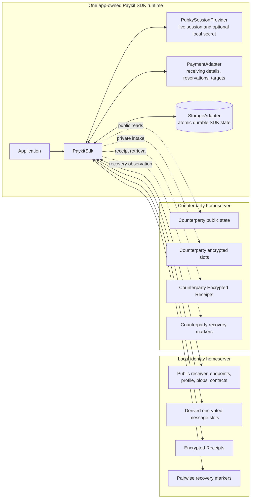
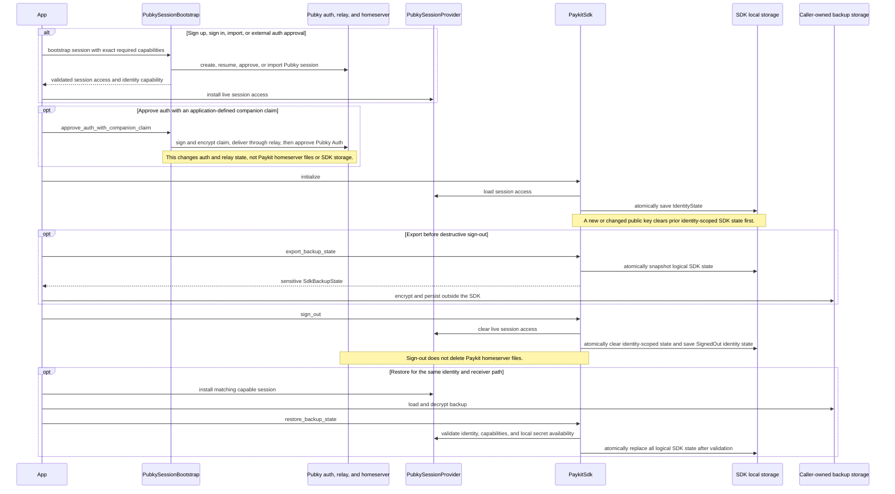
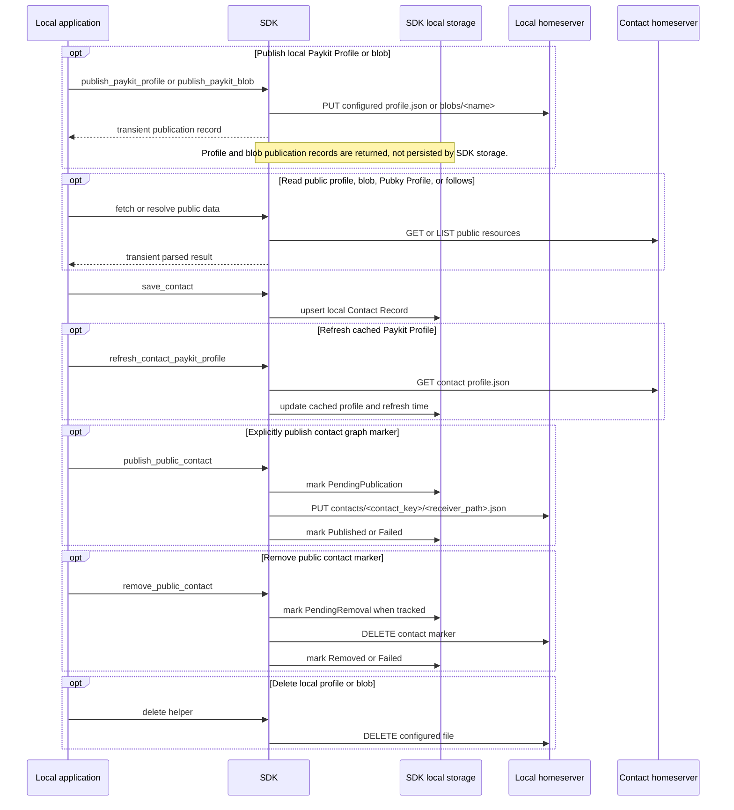
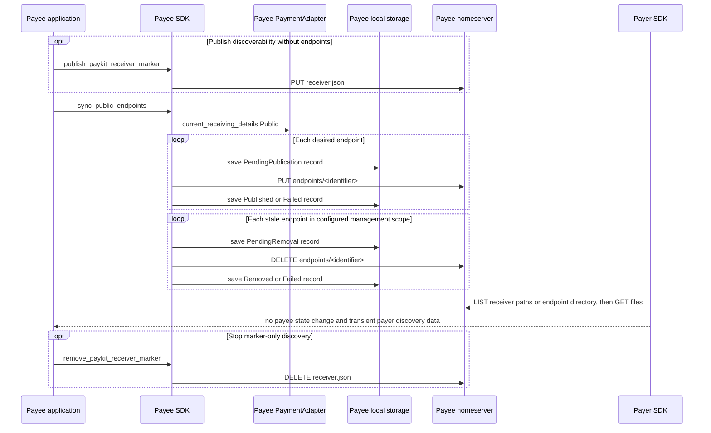
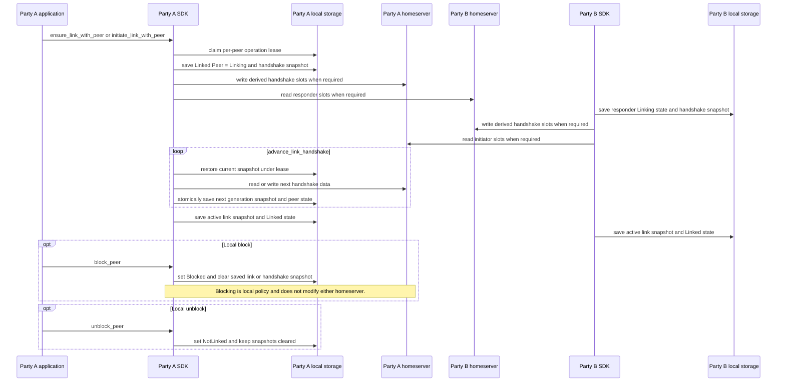
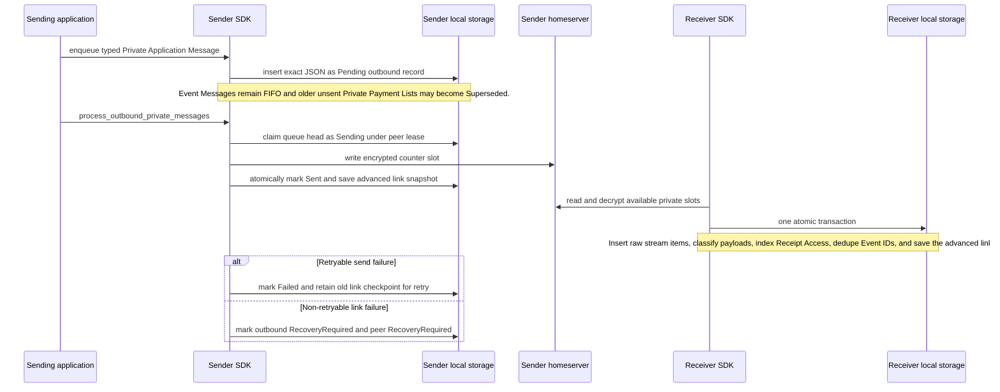
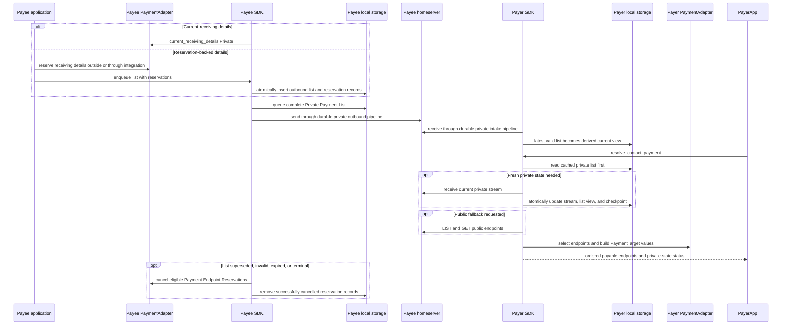
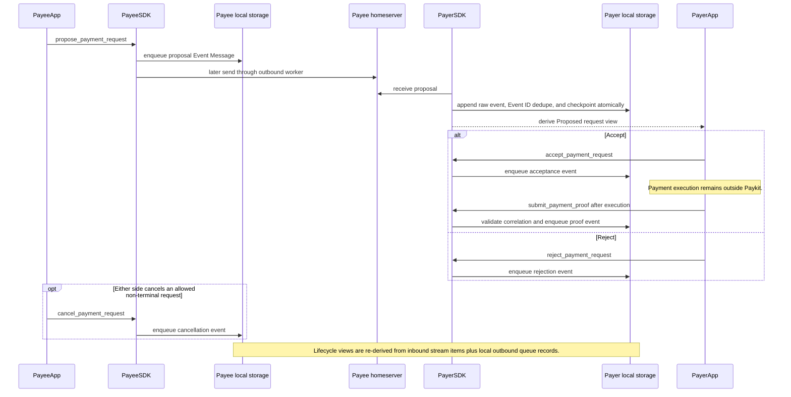
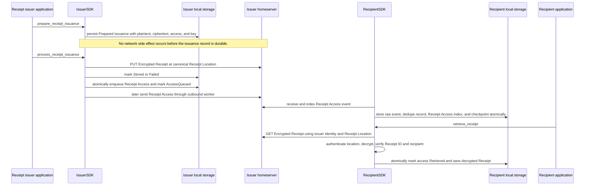
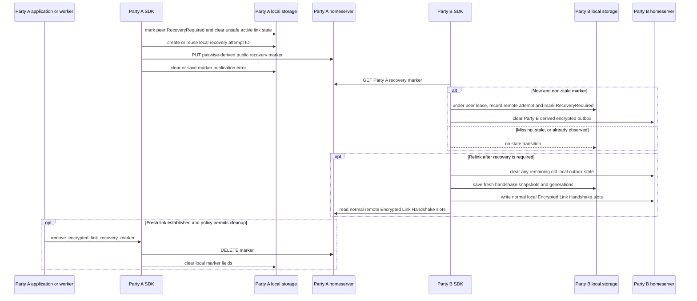

# Paykit SDK State Updates

This document maps supported `paykit-sdk` workflows across three state
boundaries:

1. **SDK local state** — durable records behind `StorageAdapter`.
2. **Live process state** — the `PubkySessionProvider`, payment adapter, temporary
   values, and operation leases.
3. **External state** — public or private files on each party's Pubky homeserver.

For payment flows, **Payer** sends value and **Payee** receives value. For private
messaging, either party can be the message sender, receiver, Receipt issuer, or
Encrypted Link initiator.

## State model

The durable `StorageState` contains identity state, Linked Peer records, Contact
Records, public endpoint publication records, Payment Endpoint Reservations,
Encrypted Link snapshots, peer-operation leases, outbound private messages,
private stream items, Event ID dedupe records, Receipt Access records, decrypted
Receipts, and receipt issuance records. Payment Request views and the current
Private Payment List are derived from those stored streams rather than kept as
separate mutable records.

Many Pubky-backed workflows begin by refreshing `IdentityState` from the live
session provider. The remaining diagrams omit that repeated preliminary update
unless identity lifecycle is the workflow being explained.

### External path categories

| State | Default receiver-scoped path |
| --- | --- |
| Receiver Marker | `/pub/paykit/v0/<receiver_path>/receiver.json` |
| Public Payment Endpoint | `/pub/paykit/v0/<receiver_path>/endpoints/<identifier>` |
| Paykit Profile | `/pub/paykit/v0/<receiver_path>/profile.json` |
| Paykit Blob | `/pub/paykit/v0/<receiver_path>/blobs/<name>` |
| Public Contact Marker | `/pub/paykit/v0/<receiver_path>/contacts/<contact_key>/<contact_receiver_path>.json` |
| Encrypted Link stream | `/pub/paykit/v0/private/<receiver_path>/messages/<pair_hash>/<slot>` |
| Encrypted Receipt | `/pub/paykit/v0/private/<issuer_receiver_path>/receipts/<receipt_id>` |
| Encrypted Link Recovery Marker | `/pub/paykit/v0/private/<receiver_path>/encrypted-link-recovery/<pair_hash>` |

Profile, blob, and contact paths move under
`/pub/<profile_namespace>/<receiver_path>/...` when a non-default profile
namespace is configured. Private paths and public Payment Endpoint paths do not.

## Session bootstrap, initialize, sign-out, and backup

Session bootstrap helpers create or validate Pubky sessions. They do not write
SDK storage until the application installs the resulting access in its provider
and calls `initialize` or another identity-refreshing SDK method.

Failure boundaries:

- If provider clearing fails, `sign_out` leaves local SDK state intact. If
  provider clearing succeeds and local clearing fails, the SDK has no live
  session but local state may remain; retry is required.
- Losing the external caller-managed backup loses private stream history,
  Encrypted Link counters, Receipt Decryption Keys, queues, contacts, and local
  payment history. Homeserver data alone cannot reconstruct them safely.
- Restore performs no homeserver writes. Unsafe or incomplete restored link
  checkpoints mark affected peers recovery-required.
- Backup export excludes active peer-operation leases and their transient lease
  state. Restore clears leases, preserves the live lease counter, and advances
  message/stream counters as needed during reconciliation.
- Exported session secrets, auth URLs, companion claims, and SDK backups are
  secret material; the SDK does not provide backup transport or at-rest
  encryption.

## Profiles, blobs, public Pubky reads, and contacts

- Contact Records are local by default. Public contact markers are opt-in and
  expose part of the contact graph.
- `sync_public_contact_markers` retries locally pending publication/removal
  records. A contact cannot be deleted while its marker may still exist.
- `resolve_contact_profile` prefers the configured Paykit Profile and can fall
  back to `/pub/pubky.app/profile.json`. These ordinary reads do not mutate local
  state unless the explicit contact refresh helper is used.
- Profile/blob/contact paths use `/pub/paykit/v0/<receiver_path>/...` by default,
  or `/pub/<profile_namespace>/<receiver_path>/...` when configured.

## Receiver discovery and public Payment Endpoint synchronization

- `ManagedOnly` removes only endpoints tracked by this SDK. `FullPaykitNamespace`
  first reads the local identity's remote Payment List and reconciles the whole
  receiver namespace.
- Local publication intent is committed before each remote write/delete so a
  failure is visible and retryable. Endpoint operations are per-file, not one
  atomic batch.
- Receiver marker publication/removal has no corresponding durable SDK
  publication record.

## Encrypted Link setup and local peer policy

- Per-peer storage-backed leases serialize link, send, receive, recovery, block,
  and unblock operations across workers.
- Snapshot generation checks prevent stale workers from replacing newer state.
- Missing, corrupt, mismatched, or unsafe snapshots transition the peer to
  `RecoveryRequired`; private automation then pauses.
- Unblocking does not restore the old link. A fresh handshake is required.

## Durable private outbound and intake pipeline

Every Private Payment List, Payment Request lifecycle event, Payment Proof, and
Receipt Access message uses this pipeline.

Important guarantees:

- `Sent` means the encrypted write completed and the sender's new checkpoint was
  committed. It is not counterparty acknowledgement.
- If a process may have written a message but crashed before the final local
  transaction, the stale `Sending` queue head is retried before later messages.
- Private receive commits raw payloads, derived indexes, dedupe records, and the
  advanced read checkpoint atomically. A storage adapter that cannot provide
  that transaction must reject the operation.
- Duplicate Event IDs with identical payloads are tracked as duplicates;
  conflicting payload reuse is retained and excluded from trusted derived views.
- Unknown or malformed private messages remain in the raw stream and do not
  replace the latest valid Private Payment List.

## Private Payment Lists, reservations, and payment resolution

- Every private update is a complete list. Clearing is an empty latest-state list,
  not deletion of old encrypted slots.
- Reservation records tie adapter-owned receiving details to the outbound list
  that shared them. Cancellation cleanup failures are reported separately from
  message delivery failures.
- `prepare_and_resolve_contact_payment` can ensure/advance the link, drain
  outbound and inbound work for bounded rounds, then resolve private-first with
  optional public fallback.
- Resolution does not execute a payment or persist the returned `PaymentTarget`.

## Payment Request lifecycle

API calls that enqueue events return local derived state, not delivery or remote
processing confirmation. The SDK enforces local role and lifecycle preconditions
for its ergonomic APIs, but payment execution, settlement confirmation,
method-specific proof validation, and recurring scheduling remain application
responsibilities.

## Receipt issuance and retrieval

- A caller-provided Receipt ID makes `issue_receipt` retry-safe. Otherwise call
  `prepare_receipt_issuance` once, retain its generated ID, then process it.
- Receipt Access delivery is separate from Encrypted Receipt storage. Repeated
  processing resumes from the durable issuance status.
- Retrieval failures update the local Receipt Access retrieval status without
  changing issuer homeserver state.

## Encrypted Link recovery markers

Recovery markers are public but pairwise-derived and minimal. They coordinate a
fresh handshake; they are not acknowledgements, transcripts, or private message
replacements. When marker policy is disabled, automatic marker I/O is skipped,
but local recovery-required state still protects unsafe private automation.

## Read-only and process-local operations

These supported operations do not themselves update SDK local storage or
homeserver data unless noted elsewhere:

- record/list queries such as `linked_peers`, `contact_records`, Payment Request
  views, receipt views, and pending queue inspection;
- path, Pubky URI, auth URL, and capability parsing/normalization;
- `identity_status` when an identity record already exists;
- public profile, blob, follows, receiver marker, receiver path, and endpoint
  reads, except `refresh_contact_paykit_profile`, which explicitly updates the
  cached Contact Record;
- payment endpoint selection and `PaymentTarget` construction by the adapter.

Some query-like private helpers may observe a remote recovery marker or attempt a
private stream refresh to prevent stale private state from being treated as
healthy; those side effects are shown in the private resolution and recovery
flows above.

## Implementation anchors

- Storage contract and records: `src/storage/mod.rs` and
  `src/storage/records.rs`
- Identity lifecycle: `src/runtime/mod.rs`, `src/pubky_session.rs`, and
  `src/runtime/backup.rs`
- Profiles and contacts: `src/runtime/profiles.rs` and
  `src/runtime/contacts.rs`
- Public endpoints: `src/runtime/public_endpoints.rs`
- Links, outbound, intake, and recovery: `src/runtime/encrypted_links.rs`,
  `src/runtime/outbound_private.rs`, `src/runtime/private_stream.rs`, and
  `src/runtime/recovery.rs`
- Private lists and resolution: `src/runtime/private_lists.rs` and
  `src/runtime/payment_resolution.rs`
- Payment Requests and receipts: `src/runtime/payment_requests.rs` and
  `src/runtime/receipts.rs`
