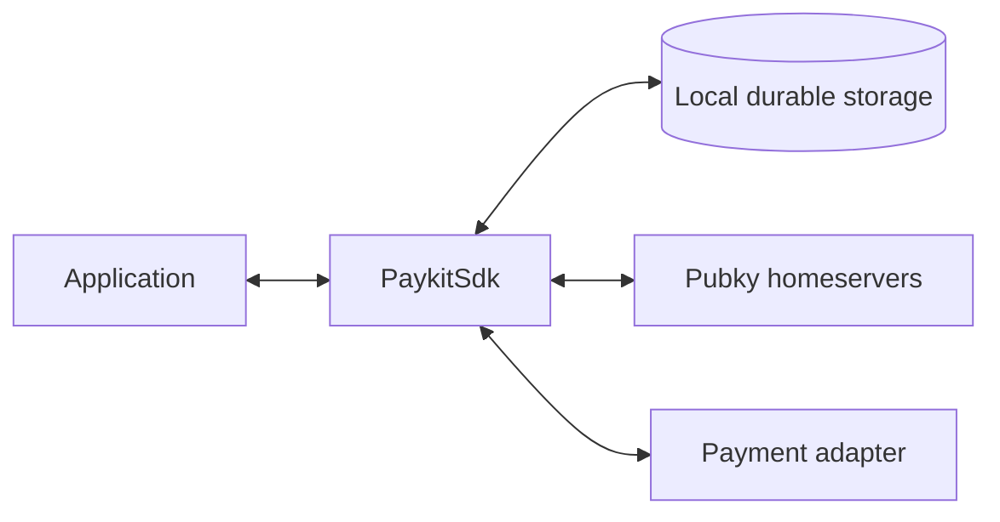
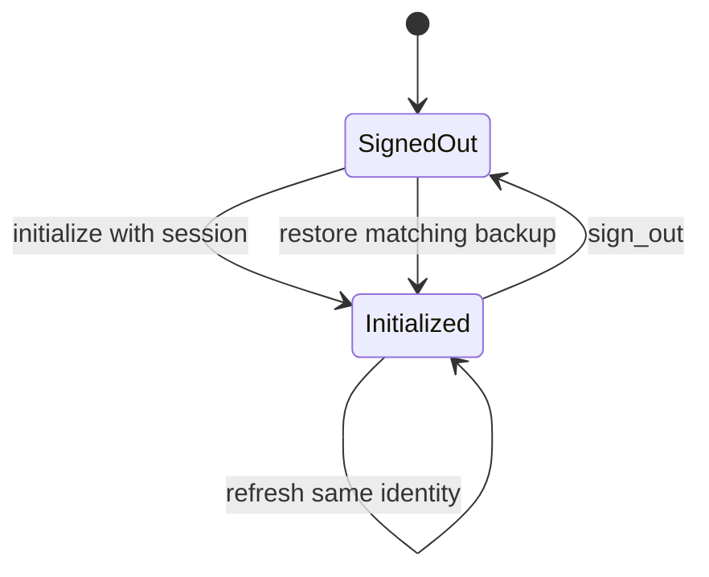
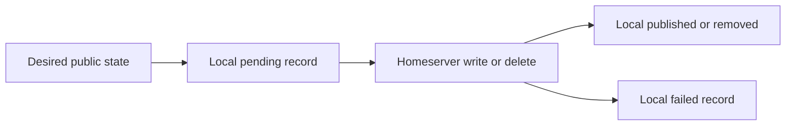
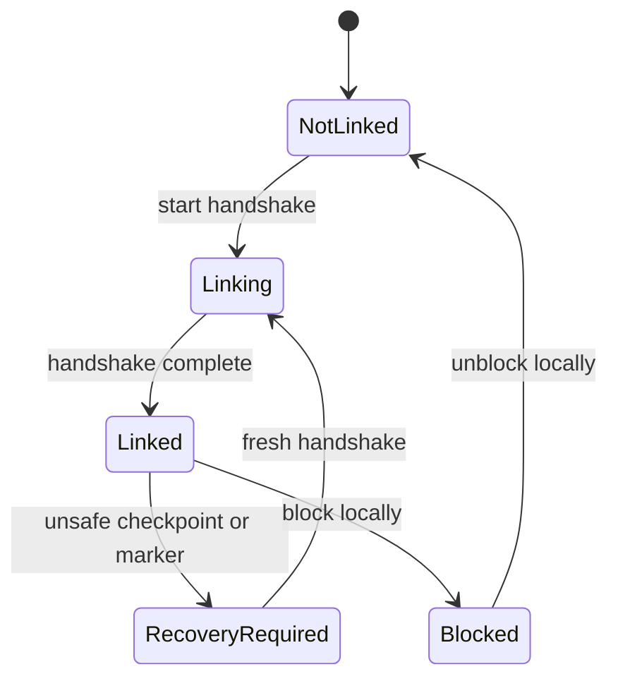
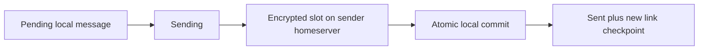
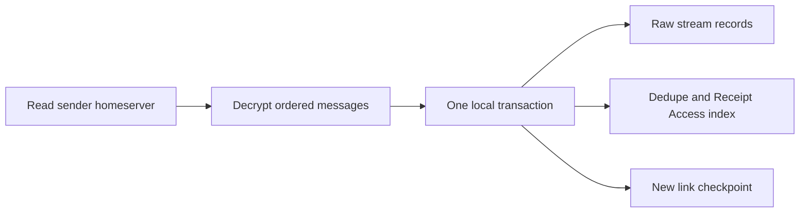
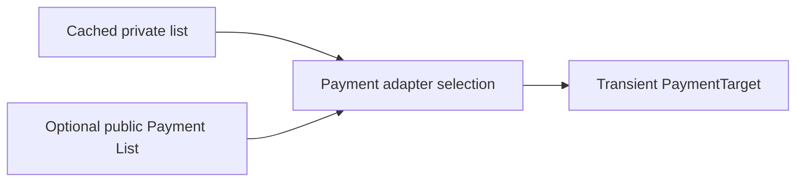
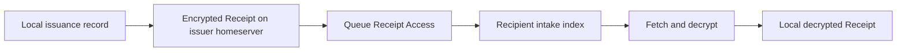

# Paykit SDK State Updates

`paykit-sdk` adds durable local state and retryable workflows above
`paykit-lib`. This document separates the main pipelines so each diagram answers
one question.

The diagrams show happy paths only. State deltas, failures, and exact paths are
kept in tables.

## Mental model

There are two independent durable systems:

- local SDK storage holds identity, contacts, queues, private stream history,
  link checkpoints, dedupe, reservations, Payment Request history, and Receipts;
- Pubky homeservers hold public files, encrypted message slots, Encrypted
  Receipts, and recovery markers.

A homeserver write and a local transaction are not one distributed transaction.
The SDK records enough local intent and progress to make retries explicit.

## Identity lifecycle

| Use case | Local durable state | External effect |
| --- | --- | --- |
| Construct SDK | None | None |
| Sign up | None until initialization | Create or authenticate homeserver account |
| Sign in or import session | None until initialization | Create live Pubky session |
| External auth | None until initialization | Auth and relay traffic |
| Initialize without session | Preserve existing identity or create signed-out state | None |
| Initialize with same identity | Refresh `IdentityState` | Read provider session only |
| Initialize with changed identity | Clear old identity-scoped state, then save new identity | Read provider session only |
| Sign out | Clear provider, then clear identity-scoped SDK state | Does not delete homeserver files |
| Export backup | Read logical SDK state | Caller stores backup outside SDK |
| Restore backup | Atomically replace validated logical state | No homeserver write |

Backups contain sensitive private state and require caller-managed encryption.
They exclude active peer-operation leases. Restore clears transient leases,
reconciles counters, and marks unsafe peers recovery-required.

## Public data

This pipeline covers public Payment Endpoints and Public Contact Markers, which
have durable publication journals.

| Use case | Local durable state | Homeserver operation |
| --- | --- | --- |
| Sync public endpoints | Pending, then Published or Failed per endpoint | Write desired endpoint files |
| Remove stale endpoints | PendingRemoval, then Removed or Failed | Delete endpoint files |
| Publish public contact | Update Contact Record publication status | Write marker |
| Remove public contact | Update Contact Record removal status | Delete marker |
| Retry contact markers | Retry each pending Contact Record independently | Write or delete marker |

These public operations do not use the publication journal:

| Use case | Local durable state | Homeserver operation |
| --- | --- | --- |
| Publish or remove Receiver Marker | Identity refresh only | Write or delete `receiver.json` |
| Publish or delete Paykit Profile | Identity refresh only | Write or delete profile file |
| Publish or delete Paykit Blob | Identity refresh only | Write or delete blob |
| Read receiver, endpoints, profiles, blobs, or follows | None | Read public resources |
| Save or remove Contact Record | Update local Contact Record | None |
| Refresh contact profile | Update cached profile in Contact Record | Read remote Paykit Profile |

Contact markers are opt-in because they expose part of the contact graph. Profile
and blob publication results are returned to the caller but not indexed in local
SDK storage.

## Encrypted Link lifecycle

| Transition | Local durable state | Homeserver operation |
| --- | --- | --- |
| Start handshake | Save Linked Peer and handshake snapshot | Configure derived paths |
| Advance handshake | Save next generation snapshot | Write local or read remote handshake slot |
| Complete handshake | Save active link snapshot and `Linked` | Final handshake traffic |
| Require recovery | Mark peer and clear unsafe link state | Optionally publish recovery marker |
| Block | Mark `Blocked` and clear link state | None |
| Unblock | Mark `NotLinked`; old link remains cleared | None |

A storage-backed per-peer lease serializes handshake, send, receive, recovery,
block, and unblock work. Snapshot generations prevent stale workers from
replacing newer link state.

## Private outbound pipeline

All outbound Private Payment Lists, Payment Request events, Payment Proofs, and
Receipt Access messages use this pipeline.

| Event | Local durable change | Homeserver change |
| --- | --- | --- |
| Enqueue | Append exact JSON as Pending | None |
| Claim | Queue head becomes Sending | None |
| Send | In-memory link advances | Write encrypted slot locally |
| Commit success | Atomically save Sent and advanced link snapshot | None |
| Retryable failure | Save Failed and retain retryable checkpoint | No confirmed change |
| Non-retryable failure | Mark message and peer recovery-required | Best-effort recovery marker |

`Sent` means the encrypted homeserver write and local checkpoint commit
completed. It is not counterparty acknowledgement.

Event Messages remain FIFO. Older unsent Private Payment Lists can be marked
Superseded because they carry latest-state semantics. A stale `Sending` queue
head is retried before later messages.

### What each use case adds

| Use case | Additional local state or rule |
| --- | --- |
| Private Payment List | Newest valid complete list supersedes older lists |
| Empty Private Payment List | Clears the derived list after delivery |
| Reservation-backed list | Atomically associate reservations with outbound ID |
| Payment Request proposal | Derive local payee lifecycle view from queued event |
| Acceptance or rejection | Enforce local payer role and allowed state |
| Cancellation | Enforce allowed non-terminal state |
| Payment Proof | Validate correlation with accepted request before queueing |
| Receipt Access | Associate outbound event with receipt issuance record |

Payment Endpoint Reservation cleanup is separate from message delivery. Adapter
cancellation failures are reported and do not silently erase local reservation
records.

## Private intake pipeline

The single transaction also updates Linked Peer receive timestamps. If any local
write fails, the whole intake batch and checkpoint roll back.

| Received content | Durable result |
| --- | --- |
| Valid Private Payment List | Raw item; latest valid list is derived on read |
| Malformed or unknown message | Raw item with parse status |
| First valid Event ID | Raw item plus dedupe record |
| Duplicate Event ID and payload | Raw item plus duplicate reference |
| Conflicting reused Event ID | Raw item plus conflict reference |
| First valid Receipt Access | Raw item, dedupe, and Receipt Access index |
| Payment Request event | Raw item used to derive lifecycle views |

Conflicted events remain auditable but are excluded from trusted derived views.
A malformed newer Private Payment List does not supersede the latest valid list.

## Resolve a contact payment

Resolution combines already-documented state sources rather than creating a new
payment record.

| Resolution mode | Possible state effect |
| --- | --- |
| Public only | Read remote public Payment List; no durable SDK update |
| Cached private | Read local private stream; may observe recovery marker |
| Fresh private | Run private intake, then derive latest valid list |
| Prepare and resolve | Ensure link, drain private work, then resolve private-first |

The returned target is transient. The SDK does not execute payments, detect
settlement, manage balances, validate method-specific proofs, or schedule
recurring payments.

## Receipts

| Step | Issuer local state | Recipient local state | Homeserver state |
| --- | --- | --- | --- |
| Prepare | Save Pending issuance | None | No change |
| Store | Mark Stored or Failed | None | Write Encrypted Receipt |
| Queue access | Mark AccessQueued and append outbound event | None | No change yet |
| Deliver access | Normal outbound pipeline | Normal intake pipeline | Encrypted message slot |
| Retrieve | None | Mark access Retrieved and save Receipt | Read issuer artifact |
| Retrieval failure | None | Save access status and error | No change |

Preparation is durable before network side effects. Receipt storage and Receipt
Access delivery are separate retryable steps.

## Recovery

| Use case | Local durable state | Homeserver operation |
| --- | --- | --- |
| Publish marker | Mark peer recovery-required and save attempt metadata | Write local pairwise marker |
| Observe marker | Save remote attempt and mark recovery-required | Read remote marker, then clear local old outbox |
| Relink | Save fresh handshake generations | Exchange fresh handshake slots |
| Remove local marker | Clear metadata after delete | Delete local marker |

Recovery markers are public but pairwise-derived. They coordinate a fresh
handshake; they are not acknowledgements or private messages.

## Homeserver paths

| State | Default path |
| --- | --- |
| Receiver Marker | `/pub/paykit/v0/<receiver_path>/receiver.json` |
| Public Payment Endpoint | `/pub/paykit/v0/<receiver_path>/endpoints/<identifier>` |
| Paykit Profile | `/pub/paykit/v0/<receiver_path>/profile.json` |
| Paykit Blob | `/pub/paykit/v0/<receiver_path>/blobs/<name>` |
| Public Contact Marker | `/pub/paykit/v0/<receiver_path>/contacts/<contact_key>/<contact_receiver_path>.json` |
| Private message | `/pub/paykit/v0/private/<receiver_path>/messages/<pair_hash>/<slot>` |
| Encrypted Receipt | `/pub/paykit/v0/private/<receiver_path>/receipts/<receipt_id>` |
| Recovery Marker | `/pub/paykit/v0/private/<receiver_path>/encrypted-link-recovery/<pair_hash>` |

A configured non-default profile namespace moves profiles, blobs, and public
contact markers under `/pub/<profile_namespace>/<receiver_path>/...`. It does not
move Payment Endpoints or private Paykit state.

## Local durable record families

| Family | Purpose |
| --- | --- |
| `IdentityState` | Current local identity and capability |
| `LinkedPeerRecord` | Link, recovery, block, and peer status |
| `EncryptedLinkStateRecord` | Secret handshake or transport checkpoint |
| `ContactRecord` | Saved contact, profile cache, public marker journal |
| `PublicEndpointRecord` | Public endpoint publication journal |
| `OutboundPrivateMessageRecord` | Durable private send queue |
| `PrivateStreamItemRecord` | Append-only received private stream |
| `EventDedupRecord` | Duplicate and conflicting Event ID tracking |
| `PaymentEndpointReservationRecord` | Adapter reservation attribution |
| `ReceiptAccessRecord` | Indexed access and retrieval status |
| `ReceiptIssuanceRecord` | Retryable receipt issuance progress |
| `ReceiptRecord` | Decrypted local Receipt |

Payment Request state and the current Private Payment List are derived views, not
separate mutable record families.

## Implementation anchors

- Storage: `src/storage/`
- Identity and backup: `src/runtime/mod.rs`, `src/pubky_session.rs`,
  `src/runtime/backup.rs`
- Public data: `src/runtime/public_endpoints.rs`, `src/runtime/profiles.rs`,
  `src/runtime/contacts.rs`
- Private transport: `src/runtime/encrypted_links.rs`,
  `src/runtime/outbound_private.rs`, `src/runtime/private_stream.rs`
- Payments and receipts: `src/runtime/private_lists.rs`,
  `src/runtime/payment_resolution.rs`, `src/runtime/payment_requests.rs`,
  `src/runtime/receipts.rs`
- Recovery: `src/runtime/recovery.rs`
