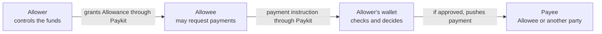

# Paykit Allowances

This document describes the product model and ownership boundaries for Allowances. Wire formats, public APIs, and atomicity are out of scope.

## TL;DR

1. A Payment Request asks a Payer to make a payment. A Subscription is an accepted Recurring Payment Request.
2. An Allowance gives an Allowee limited permission to request payments from an Allower's wallet without fresh approval each time.
3. The Payee may be the Allowee or another party. Paykit coordinates the Allowance; the wallet decides whether and how to execute each payment.

## What an Allowance is

An Allowance is privately shared permission from an Allower to an Allowee. The Allower keeps control of the funds and approves the terms in advance. The Allowee can then request payments that fit those terms.

An Allowance creates no payment by itself and does not schedule payments. It is used only when the Allowee submits a payment instruction. The Payee named by that instruction may be the Allowee or another party.

All payments remain push payments initiated by the Allower's wallet. The Allowee cannot extract funds, hold payment credentials, sign payments, or bypass the wallet.

An Allowance is not a balance, a reservation of funds, or a guarantee of payment. It does not replace wallet security, transaction signing, payment-method-specific validation, or Receipts.

## Roles and payment flow

- **Allower:** owns or controls the funds and grants the permission. The Allower is the Payer when a payment is executed.
- **Allowee:** is authorized to use the Allowance by submitting payment instructions.
- **Payee:** receives a particular payment. The Payee may be the Allowee or another party.

## Relationship to Payment Requests and Subscriptions

In the current protocol, a Payment Request asks a Payer to pay the requesting Payee; it may be one-time or recurring. An accepted Recurring Payment Request is called a Subscription.

By contrast, an Allowance grants authority before any payment instruction exists. The Allowee may request payment to itself or another Payee, subject to the Allowance terms and the Allower's wallet checks.

A wallet may apply private automatic-handling rules to ordinary Payment Requests. Those rules are wallet policy, not an Allowance.

## Allowance lifecycle and wallet safeguards

An Allowance is bound to one Allower-Allowee pair and has a stable Allowance ID and shared terms.

Either party may propose exact terms, but both must accept them. The Allower must explicitly approve any grant or increase of authority. There are no counteroffers; changing accepted terms requires a new proposal and ending the old Allowance.

Either party may end an accepted Allowance: the Allower revokes the authority, while the Allowee relinquishes it. An Allowance may also expire as defined in its terms.

Shared terms define the maximum authority communicated to the Allowee. The Allower's wallet may privately enforce stricter safeguards and may decline any instruction. Those safeguards are not Allowances, need not be shared, and cannot expand the shared authority.

Shared means the Allower and Allowee both know and accept the maximum terms. Enforcement remains with the Allower's wallet and does not rely on the Allowee or Payee to report usage or errors.

## Policy rules

Every configured Allowance rule must pass. V1 excludes OR groups, ordered allow or deny rules, FX, and cross-asset evaluation.

Rules may cover:

- an inclusive amount range for each payment
- total amount or instruction count within a period
- a lifetime amount limit
- activation and expiry times
- restrictions on Payees
- allowed Payment Endpoint Identifiers

Each Allowance uses one asset for shared limits and usage accounting. A payment instruction's Payment Amount must use that asset, and the Allower's wallet enforces the match. The wallet may fund or route the payment using another asset, but Paykit does not define conversion or compare usage across assets. Amounts reuse Payment Amount and use exact decimal arithmetic. Asset values must match exactly; Paykit does not define asset precision.

Period limits may use anchored periods or rolling windows. Months and years are UTC calendar periods with deterministic end-of-month handling. Rolling windows use fixed minutes, hours, days, or weeks.

Only the instruction's Payment Amount consumes capacity. Fees do not count, and refunds do not restore capacity. An Allowance without an expiry remains active until ended.

An instruction is approved or declined for its exact Payment Amount. The wallet must not automatically substitute another amount.

## Evaluation and execution

The intended flow is:

1. The Allowee submits a payment instruction that references the Allowance ID and identifies the exact Payment Amount, Payee, payment destination, and a unique instruction ID.
2. Paykit Library parses and structurally validates the message. Paykit SDK checks that it came from the bound Allowee and that recorded lifecycle events show the Allowance was accepted and not ended. It then persists, correlates, and deduplicates the instruction.
3. Before execution, using trusted time and durable history, the wallet evaluates activation and expiry, the remaining shared terms, private safeguards, current usage, replay protection, destination authenticity, freshness, revocation status, and payment capability.
4. If approved, the wallet pays the Payee directly using the selected payment method.
5. Paykit SDK may communicate the result and any supported proof information to the Allowee.

The future protocol specification must define how Payees and payment destinations are represented and authenticated, how destination expiry, replacement, or revocation is communicated, how instructions and results are correlated, and which lifecycle messages are required. A wallet must decline automatic execution when it cannot establish that a destination is current and usable. The existing Payment Proof is tied to a Payment Request, so its direct reuse is not assumed here.

Where the Payee publishes or shares a payment destination through Paykit, it must be able to communicate an authenticated withdrawal or replacement if that destination is compromised. Once the wallet observes that change, it must not start a new payment to the withdrawn destination, even when the instruction otherwise satisfies the Allowance.

## Component responsibilities

This is the intended responsibility split for a future Allowance protocol:

| Component | Intended responsibility |
| --- | --- |
| Paykit Protocol and Paykit Library | Shared Allowance terms, IDs, lifecycle and payment-instruction shapes, parsing, serialization, structural validation, and stateless correlation. |
| Paykit SDK | Durable lifecycle state, ordered event handling, message queues, sender and lifecycle checks, message deduplication, recovery, and app-facing records. |
| Wallet | Consent, supported terms, private safeguards, trusted time, policy evaluation, usage accounting, capacity, concurrency, replay protection, authentication, and the decision to pay. It also handles payment-specific work such as selecting a Payment Endpoint and funds, checking fees and balances, signing, broadcasting, monitoring settlement, and validating proof. |

Paykit Library remains stateless and payment-method-neutral: it does not evaluate wallet policy, reserve capacity, or move funds. Paykit SDK coordinates the workflow but does not decide to pay. The self-custody wallet applies the rules, controls the credentials, and executes the payment.

An Allowance ID is a correlation identifier, not a bearer credential.

## Decision log (dont worry about manually reviewing this)

This is the audit trail for the product discussion, not required reading for the main concept. Later decisions take precedence where noted.

### Earlier decisions (historical, 1-37)

These entries are retained as history, not as current requirements. Decisions 38 through 50 state the current direction and identify which earlier decisions they supersede.

1. **How do Payment Requests, Allowances, and Subscriptions relate?** Initial answer: automatic charges use one-time Payment Requests, and a scheduled Allowance is a Subscription. Decisions 29 and 30 later kept Recurring Payment Requests for scheduled payments.
2. **Who may propose a shared Allowance?** Either payer or payee.
3. **Can either party counteroffer?** No. Proposals contain exact terms and may only be accepted or rejected.
4. **Must a payee accept a payer's proposal?** Yes, before it becomes an active shared Allowance.
5. **How are policies represented?** As composable rule types.
6. **How are rules combined?** Every configured rule must pass. V1 has no OR or ordered allow or deny rules.
7. **Which controls are in scope?** Per-payment and period amounts, schedules and windows, validity, request count, lifetime total, and endpoint restrictions.
8. **Which period styles are supported?** Anchored periods and rolling windows.
9. **Can one Allowance use multiple assets or FX?** No. It uses one asset and performs no FX.
10. **How does a request select a shared Allowance?** By exact Allowance ID. Local Allowances are matched without an ID, as decided in 19.
11. **Who may cancel a shared Allowance?** Either party, unilaterally.
12. **Can shared terms be edited?** No. Changed terms require a new proposal and cancellation of the old Allowance.
13. **When is capacity consumed?** It is reserved atomically before signing or another irreversible action.
14. **Who determines payment success?** Payment-method code reports a generic outcome. Unknown stays reserved, failure releases, and verified payment commits.
15. **What happens when a shared request passes?** The SDK queues Payment Request Acceptance before preparing payment work.
16. **When can a scheduled payment execute?** Within explicit early and late bounds, not anywhere in its accounting period.
17. **What happens when a shared request fails?** The SDK rejects it automatically.
18. **What does that rejection reveal?** Only the failed rule category, never usage or remaining capacity.
19. **Must an Allowance be shared?** No. A local Allowance stays wallet-only and sends no automatic response when a request fails.
20. **How are overlapping local policies avoided?** Only one may be active for the same payee Pubky key, Paykit Receiver Path, and asset.
21. **How are local terms changed?** Atomically in place, retaining identity and audit history.
22. **How is a per-payment amount constrained?** With an inclusive range. Equal bounds mean an exact amount.
23. **Do refunds restore capacity?** No.
24. **Do fees consume capacity?** No. Only the requested Payment Amount counts.
25. **How are calendar periods anchored?** In UTC, with deterministic month and year behavior.
26. **Which units can roll?** Minutes, hours, days, and weeks. Months and years are anchored.
27. **Is expiry required?** No. An Allowance may remain active until canceled.
28. **How are assets and amounts represented?** With PaymentAmount, exact asset matching, and exact decimal arithmetic.
29. **Who triggers a scheduled Subscription payment?** The payee sends a new Payment Request for each Billing Period. The payer's wallet validates it under the scheduled Allowance and pushes the payment.
30. **What does accepting a Recurring Payment Request create?** A Subscription and a locally derived scheduled Allowance, with no second protocol flow.
31. **Can one Allowance have both trigger modes?** No.
32. **What amount is paid on schedule?** The exact accepted amount. A change requires a new proposal.
33. **How does the SDK expose the modes?** As one Allowance model with mutually exclusive variants.
34. **What scheduling belongs in the library?** Pure evaluation from terms, time, and supplied history. The wallet owns state and execution.
35. **What does request evaluation return?** Eligibility and the exact reservation intent.
36. **What does a shared Allowance promise?** Eligibility for automatic handling, not guaranteed payment.
37. **How is a scheduled occurrence identified?** By the existing Billing Period on its Payment Proof.

### Current direction (38-50)

38. **What is an Allowance?** Scoped permission granted by an Allower to an Allowee to request qualifying payments from the Allower's wallet without fresh approval each time. This supersedes the Subscription-oriented model in 1 and 30.
39. **Who are the parties?** The Allower controls the funds, the Allowee may use the Allowance, and the Payee receives each payment.
40. **Must the Allowee be the Payee?** No. A payment may go to the Allowee or another Payee.
41. **How do Allowances relate to Subscriptions?** They are separate. A Subscription is an accepted Recurring Payment Request; an Allowance does not schedule payments and creates no payment by itself. This supersedes the schedule-related parts of 7, 16, 29 through 34, and 37.
42. **Is an Allowance shared?** Yes. The grant, stable Allowance ID, terms, and lifecycle are shared between the exact Allower and Allowee. Private wallet safeguards are not a separate Allowance. This supersedes the local-Allowance model in 10 and 19 through 21.
43. **Who may propose, approve, or end an Allowance?** Either party may propose exact terms, both must accept them, and either may end the relationship. No Allowance can grant or increase authority without the Allower's explicit approval. This replaces the earlier payer and payee role wording in 2 and 4.
44. **How is an Allowance used?** The Allowee submits a uniquely identified payment instruction referencing the Allowance ID and identifying the exact Payment Amount, Payee, and destination. Its wire shape remains for a future specification. This supersedes the Payment Request flow in 10, 15, 17, and 18.
45. **Who evaluates an instruction?** The Allower's wallet evaluates shared terms, private safeguards, usage, replay protection, and payment capability. Paykit owns structural validation, correlation, and durable coordination. Earlier implementation details in 13 through 18, 34, and 35 are not current requirements where they assign policy or execution decisions to Paykit Library or Paykit SDK.
46. **What does an accepted Allowance promise?** Prior authority to submit qualifying instructions, not guaranteed acceptance, funds, execution, or settlement. This supersedes 36.
47. **Does this document define atomicity?** No. Atomicity is out of scope.
48. **Who enforces shared terms?** The Allower's wallet. Shared terms give both parties the same maximum scope, but the wallet does not trust the Allowee or Payee to report usage or errors.
49. **May the wallet adjust an instruction's amount automatically?** No. It approves or declines the instruction for its exact Payment Amount.
50. **How are compromised payment destinations handled?** Where the Payee publishes or shares a destination through Paykit, it can communicate an authenticated withdrawal or replacement. Once observed, the wallet must not start a new payment to that destination, even when the instruction otherwise qualifies.
