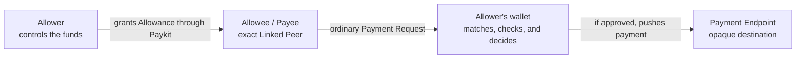

# Paykit Allowances

This document describes the product model and ownership boundaries for Allowances. Wire formats, public APIs, and atomicity are out of scope.

## TL;DR

1. A Payment Request asks a Payer to make a payment. A Subscription is an accepted Recurring Payment Request.
2. An Allowance preauthorizes the Allower's wallet to handle qualifying Payment Requests from an exact Linked Peer without fresh approval each time.
3. Payment Requests remain unchanged. The wallet privately matches a new request to one active Allowance and retains control over every payment.

## What an Allowance is

An Allowance is privately shared permission from an Allower to an Allowee. The Allower keeps control of the funds and approves the terms in advance. When the wallet's local automatic-payment setting is enabled, it may use that permission to handle ordinary Payment Requests from the Allowee that fit those terms.

An Allowance creates no payment by itself and does not schedule payments. It is used only as an optional wallet authorization for an unchanged Payment Request. A Payment Request does not carry an Allowance ID, and Payees do not need an Allowance to use the existing Payment Request flow.

All payments remain push payments initiated by the Allower's wallet. The Allowee cannot extract funds, hold payment credentials, sign payments, or bypass the wallet.

An Allowance is not a balance, a reservation of funds, or a guarantee of payment. It does not replace wallet security, transaction signing, payment-method-specific validation, or Receipts.

## Roles and payment flow

- **Allower:** owns or controls the funds and grants the permission. The Allower is the Payer when a payment is executed.
- **Allowee:** is the exact authenticated Linked Peer whose qualifying Payment Requests may be handled without fresh approval.
- **Payee:** is the authenticated Payment Request sender and therefore the same protocol party as the Allowee. A Payment Endpoint Payload is opaque, so Paykit does not infer or authenticate its ultimate economic beneficiary.

## Relationship to Payment Requests and Subscriptions

In the current protocol, a Payment Request asks a Payer to pay the requesting Payee; it may be one-time or recurring. An accepted Recurring Payment Request is called a Subscription. Allowances do not alter the Payment Request wire format, lifecycle, or endpoint resolution. They can automate Acceptance and payment only when the wallet opts in.

An Allowance grants authority before a qualifying Payment Request arrives. When local automatic payment is enabled, the wallet may match a newly handled request from the bound Allowee to exactly one active, compatible Allowance. On that first decision it durably records either the selected Allowance or a manual-only disposition. If automatic handling stops before Acceptance while the request remains actionable, it stays proposed in the ordinary manual flow and is not rematched automatically later; proposal expiry or a terminal event takes precedence. If Acceptance was already recorded and the request is not cancelled, the wallet uses durable payment and reservation state to expose the accepted-but-unpaid request for explicit payment without accepting it again. It is not automatically rejected.

One-time and Recurring Payment Requests use the same matching policy. A wallet may automatically accept a qualifying Recurring Payment Request and pin the selected Allowance for that Subscription. Acceptance consumes no Allowance capacity. For every Billing Period, the wallet rechecks that Allowance's lifecycle, terms, remaining capacity, and private safeguards before starting an automatic payment. A safely unpaid period may be paid explicitly without another Acceptance. Recurrence and Billing Period scheduling remain part of the Payment Request and wallet implementation; ending the Allowance does not cancel the Subscription.

Requests already pending when an Allowance becomes active are not reconsidered automatically. Changing Allowances, local enablement, capacity, or endpoint availability does not revisit a request's stored manual-only disposition. This avoids a new grant unexpectedly acting on previously received requests.

## Allowance lifecycle and wallet safeguards

An Allowance is bound to one Allower-Allowee pair and has a stable Allowance ID and shared terms.

Either party may propose exact terms, but both must accept them. The Allower must explicitly approve any grant or increase of authority. There are no counteroffers; changing accepted terms requires a new proposal and ending the old Allowance.

Either party may end an accepted Allowance: the Allower revokes the authority, while the Allowee relinquishes it. An Allowance may also expire as defined in its terms.

Shared terms define the maximum authority communicated to the Allowee. The Allower's wallet may privately enforce stricter safeguards and may decline automatic handling of any request. Those safeguards are not Allowances, need not be shared, and cannot expand the shared authority.

Shared means the Allower and Allowee both know and accept the maximum terms. Enforcement remains with the Allower's wallet and does not rely on the Allowee or Payee to report usage or errors.

## Policy rules

Every configured Allowance rule must pass. V1 excludes OR groups, ordered allow or deny rules, FX, and cross-asset evaluation.

Rules may cover:

- an inclusive amount range for each payment
- total amount or payment count within a period
- a lifetime amount limit
- activation and expiry times
- allowed Payment Endpoint Identifiers

Each Allowance uses one asset for shared limits and usage accounting. A Payment Request's Payment Amount must use that asset, and the Allower's wallet enforces the match. The wallet may fund or route the payment using another asset, but Paykit does not define conversion or compare usage across assets. Amounts reuse Payment Amount and use exact decimal arithmetic. Asset values must match exactly; Paykit does not define asset precision.

Period limits may use anchored periods or rolling windows. Months and years are UTC calendar periods with deterministic end-of-month handling. Rolling windows use fixed minutes, hours, days, or weeks.

Only payments automatically authorized by the Allowance consume capacity. Receiving or accepting a Payment Request consumes none, and manually approved payments do not count against Allowance usage. A successful or unresolved manual payment still blocks later automatic payment of that same one-time request or Billing Period. Each automatic Subscription payment consumes capacity separately. Fees do not count, and refunds do not restore capacity. An Allowance without an expiry remains active until ended.

A capacity reservation is committed for a verified payment, released after a confirmed terminal failure, and retained while the outcome is pending or unknown. Counted usage includes committed payments and unresolved reservations, not released failures. The wallet must not automatically substitute another amount for the Payment Request's exact Payment Amount.

## Evaluation and execution

The intended flow is:

1. The Allowee sends an ordinary Payment Request over the same authenticated Encrypted Link to which the Allowance is bound.
2. Paykit processes that request through its existing parsing, lifecycle, correlation, and deduplication behavior.
3. If local automatic payment is enabled, the wallet considers only active Allowances for that exact Request sender and link. It automatically handles the request only when exactly one compatible Allowance matches.
4. Before automatic Acceptance, the wallet performs every applicable preflight check it can. Before each irreversible payment step, using trusted time and durable history, it rechecks the request lifecycle, Allowance lifecycle and terms, private safeguards, current usage, replay protection, selected Payment Endpoint, and payment capability.
5. If approved, the wallet uses the normal Payment Request Acceptance, endpoint-resolution, payment, and Payment Proof flow. A failure before Acceptance keeps an actionable request in the proposed manual flow; a safe failure after Acceptance uses the wallet's accepted-but-unpaid explicit-payment path without another Acceptance.
6. Cancellation stops new execution. If payment was already irreversible, the wallet may still send its ordinary Payment Proof; a crossing Acceptance may be recorded, but the request remains cancelled.

The selected Payment Endpoint is resolved and validated under the normal Payment Request rules. Allowances add no destination reference, public destination digest, observation message, replacement mechanism, or separate proof. A missing, stale, consumed, invalid, unsupported, or otherwise uncertain endpoint prevents automatic payment but does not change the underlying Payment Request state.

An Allowance ID identifies the shared policy lifecycle. It is not sent in a Payment Request. The wallet privately records which Allowance authorized an automatic one-time payment or Subscription so usage and replay checks remain deterministic.

## Component responsibilities

This is the intended responsibility split for a future Allowance protocol:

| Component | Intended responsibility |
| --- | --- |
| Paykit Protocol and Paykit Library | Shared Allowance terms, IDs and lifecycle shapes, parsing, serialization, structural validation, and the unchanged Payment Request protocol. |
| Paykit SDK | Durable Allowance and Payment Request lifecycle state, ordered event handling, message queues, sender and link context, message deduplication, recovery, and app-facing records. |
| Wallet | The local auto-pay setting, matching exactly one Allowance, pinning it to automatic handling, trusted time, private safeguards, usage accounting, capacity, concurrency, replay protection, and the decision to pay. It also handles payment-specific work such as selecting a Payment Endpoint and funds, checking fees and balances, signing, broadcasting, monitoring settlement, and validating proof. |

Paykit Library remains stateless and payment-method-neutral: it does not evaluate wallet policy, reserve capacity, or move funds. Paykit SDK coordinates the workflow but does not decide to pay. The self-custody wallet applies the rules, controls the credentials, and executes the payment.

An Allowance ID is a correlation identifier, not a bearer credential.

## Decision log (dont worry about manually reviewing this)

This is the audit trail for the product discussion, not required reading for the main concept. Later decisions take precedence where noted.

### Earlier decisions (historical, 1-37)

These entries are retained as history, not as current requirements. Decisions 38 through 50 record a later standalone-instruction model. Decisions 51 onward state the current direction and supersede conflicts in both earlier groups.

1. **How do Payment Requests, Allowances, and Subscriptions relate?** Initial answer: automatic charges use one-time Payment Requests, and a scheduled Allowance is a Subscription. Decisions 29 and 30 later kept Recurring Payment Requests for scheduled payments.
2. **Who may propose a shared Allowance?** Either payer or payee.
3. **Can either party counteroffer?** No. Proposals contain exact terms and may only be accepted or rejected.
4. **Must a payee accept a payer's proposal?** Yes, before it becomes an active shared Allowance.
5. **How are policies represented?** As composable rule types.
6. **How are rules combined?** Every configured rule must pass. V1 has no OR or ordered allow or deny rules.
7. **Which controls are in scope?** Per-payment and period amounts, schedules and windows, validity, request count, lifetime total, and endpoint restrictions.
8. **Which period styles are supported?** Anchored periods and rolling windows.
9. **Can one Allowance use multiple assets or FX?** No. It uses one asset and performs no FX.
10. **How does a request select a shared Allowance?** By exact Allowance ID. Local Allowances are matched without an ID, as decided in 19.
11. **Who may cancel a shared Allowance?** Either party, unilaterally.
12. **Can shared terms be edited?** No. Changed terms require a new proposal and cancellation of the old Allowance.
13. **When is capacity consumed?** It is reserved atomically before signing or another irreversible action.
14. **Who determines payment success?** Payment-method code reports a generic outcome. Unknown stays reserved, failure releases, and verified payment commits.
15. **What happens when a shared request passes?** The SDK queues Payment Request Acceptance before preparing payment work.
16. **When can a scheduled payment execute?** Within explicit early and late bounds, not anywhere in its accounting period.
17. **What happens when a shared request fails?** The SDK rejects it automatically.
18. **What does that rejection reveal?** Only the failed rule category, never usage or remaining capacity.
19. **Must an Allowance be shared?** No. A local Allowance stays wallet-only and sends no automatic response when a request fails.
20. **How are overlapping local policies avoided?** Only one may be active for the same payee Pubky key, Paykit Receiver Path, and asset.
21. **How are local terms changed?** Atomically in place, retaining identity and audit history.
22. **How is a per-payment amount constrained?** With an inclusive range. Equal bounds mean an exact amount.
23. **Do refunds restore capacity?** No.
24. **Do fees consume capacity?** No. Only the requested Payment Amount counts.
25. **How are calendar periods anchored?** In UTC, with deterministic month and year behavior.
26. **Which units can roll?** Minutes, hours, days, and weeks. Months and years are anchored.
27. **Is expiry required?** No. An Allowance may remain active until canceled.
28. **How are assets and amounts represented?** With PaymentAmount, exact asset matching, and exact decimal arithmetic.
29. **Who triggers a scheduled Subscription payment?** The payee sends a new Payment Request for each Billing Period. The payer's wallet validates it under the scheduled Allowance and pushes the payment.
30. **What does accepting a Recurring Payment Request create?** A Subscription and a locally derived scheduled Allowance, with no second protocol flow.
31. **Can one Allowance have both trigger modes?** No.
32. **What amount is paid on schedule?** The exact accepted amount. A change requires a new proposal.
33. **How does the SDK expose the modes?** As one Allowance model with mutually exclusive variants.
34. **What scheduling belongs in the library?** Pure evaluation from terms, time, and supplied history. The wallet owns state and execution.
35. **What does request evaluation return?** Eligibility and the exact reservation intent.
36. **What does a shared Allowance promise?** Eligibility for automatic handling, not guaranteed payment.
37. **How is a scheduled occurrence identified?** By the existing Billing Period on its Payment Proof.

### Previous direction (38-50)

38. **What is an Allowance?** Scoped permission granted by an Allower to an Allowee to request qualifying payments from the Allower's wallet without fresh approval each time. This supersedes the Subscription-oriented model in 1 and 30.
39. **Who are the parties?** The Allower controls the funds, the Allowee may use the Allowance, and the Payee receives each payment.
40. **Must the Allowee be the Payee?** No. A payment may go to the Allowee or another Payee.
41. **How do Allowances relate to Subscriptions?** They are separate. A Subscription is an accepted Recurring Payment Request; an Allowance does not schedule payments and creates no payment by itself. This supersedes the schedule-related parts of 7, 16, 29 through 34, and 37.
42. **Is an Allowance shared?** Yes. The grant, stable Allowance ID, terms, and lifecycle are shared between the exact Allower and Allowee. Private wallet safeguards are not a separate Allowance. This supersedes the local-Allowance model in 10 and 19 through 21.
43. **Who may propose, approve, or end an Allowance?** Either party may propose exact terms, both must accept them, and either may end the relationship. No Allowance can grant or increase authority without the Allower's explicit approval. This replaces the earlier payer and payee role wording in 2 and 4.
44. **How is an Allowance used?** The Allowee submits a uniquely identified payment instruction referencing the Allowance ID and identifying the exact Payment Amount, Payee, and destination. Its wire shape remains for a future specification. This supersedes the Payment Request flow in 10, 15, 17, and 18.
45. **Who evaluates an instruction?** The Allower's wallet evaluates shared terms, private safeguards, usage, replay protection, and payment capability. Paykit owns structural validation, correlation, and durable coordination. Earlier implementation details in 13 through 18, 34, and 35 are not current requirements where they assign policy or execution decisions to Paykit Library or Paykit SDK.
46. **What does an accepted Allowance promise?** Prior authority to submit qualifying instructions, not guaranteed acceptance, funds, execution, or settlement. This supersedes 36.
47. **Does this document define atomicity?** No. Atomicity is out of scope.
48. **Who enforces shared terms?** The Allower's wallet. Shared terms give both parties the same maximum scope, but the wallet does not trust the Allowee or Payee to report usage or errors.
49. **May the wallet adjust an instruction's amount automatically?** No. It approves or declines the instruction for its exact Payment Amount.
50. **How are compromised payment destinations handled?** Where the Payee publishes or shares a destination through Paykit, it can communicate an authenticated withdrawal or replacement. Once observed, the wallet must not start a new payment to that destination, even when the instruction otherwise qualifies.

### Current direction (51-65)

51. **How is an Allowance used?** Only through an ordinary Payment Request. There is no separate Payment Instruction. This supersedes 44 and the instruction-specific parts of 45, 46, 49, and 50.
52. **Does a Payment Request select an Allowance?** No. Its wire shape remains unchanged and carries no Allowance ID. The wallet privately matches the authenticated Request sender and terms to exactly one active compatible Allowance; zero or multiple matches retain manual handling. This supersedes 10 and 44.
53. **Who are the Allowee and Payee?** For Allowance matching, the exact authenticated Payment Request sender and Encrypted Link identify both the Allowee and protocol Payee. A Payment Endpoint Payload is opaque, so its ultimate economic beneficiary is unknown and out of Paykit's scope. This supersedes the separate or third-party Payee model in 39 and 40.
54. **How are Payment Endpoints handled?** Exactly as they are for Payment Requests without an Allowance. Allowances add no destination reference, digest, observation, withdrawal, replacement, or proof mechanism. This supersedes 50.
55. **What happens when matching or validation fails?** Before Acceptance, a still-actionable Payment Request stays proposed in its existing manual response flow and is not automatically rejected; expiry or a terminal event takes precedence. After Acceptance, decision 65 applies. This supersedes 17 and 18.
56. **Are existing Payment Requests affected?** No. Allowances are optional and do not change current Payment Request behavior. The wallet durably records the first selected-Allowance or request-level manual-only disposition; a request left manual-only before Acceptance is not reconsidered automatically after policy, setting, capacity, or endpoint changes. Billing Periods on an already pinned Subscription remain independently evaluated under decision 59.
57. **Who enables automatic handling?** The Allower's wallet through a private local setting. An accepted Allowance communicates maximum authority but never forces the wallet to enable or execute automatic payments.
58. **Do one-time and Recurring Payment Requests differ?** No for Allowance matching. A qualifying Recurring Payment Request may be accepted automatically, while its existing Recurrence and the wallet continue to determine Billing Periods. This refines 41 without making Allowances a scheduling protocol.
59. **How does a Subscription retain authority?** The wallet pins the selected Allowance when it automatically accepts the Recurring Payment Request and rechecks that Allowance before every Billing Period payment. Ending the Allowance prevents further automatic authorization but does not cancel the Subscription.
60. **When does capacity count?** Only when an Allowance automatically authorizes a payment. Request receipt and acceptance consume none, manual payments do not count but still satisfy and block automatic execution of the same payment occurrence, and each automatic Subscription payment counts separately. This supersedes request- and instruction-count interpretations in 7, 13, and 45.
61. **How do payment outcomes affect capacity?** A confirmed terminal failure releases its reservation, a verified payment commits it, and a pending or unknown outcome remains reserved. This confirms the outcome rule in 14 for the current model.
62. **Which payment workflow is used?** The existing Payment Request Acceptance, endpoint resolution, cancellation, execution, and Payment Proof workflow. The wallet rechecks Request and Allowance state before the irreversible payment step.
63. **What does the wallet persist?** It privately records which Allowance authorized an automatic one-time payment or Subscription, along with usage and replay state. That association is wallet state and does not alter the shared Payment Request.
64. **What if cancellation crosses an irreversible payment?** Cancellation prevents new execution but does not invalidate an execution already past its irreversible boundary. The wallet may send its ordinary Payment Proof afterward. A payee may record a crossing Acceptance first observed after its own Cancellation, but neither event reopens the cancelled request. This resolves the earlier open Payment Request question without adding an Allowance-specific proof.
65. **What if automatic handling stops after Acceptance?** If the request is not cancelled, it remains accepted. Once no automatic attempt or reservation and no payment through an automatic or manual path is successful or unresolved, the wallet marks that one-time request or affected Billing Period manual-only and exposes it for explicit payment without another Acceptance or later automatic retry. This refines 15, 55, and 62; it does not make every accepted request actionable.
